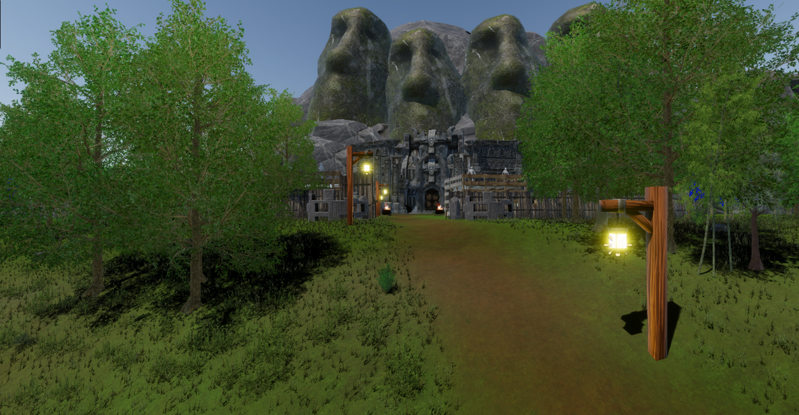

<h1 align="center">
  
</h1>

  

<h3 align="center">🎮 Game Developer • 🔧 Embedded Systems Architect • 💻 Web/Frontend Enthusiast</h3>

---

## 🔭 **Currently Working On**

### 🎯 **Secret of Chronicles** 
*Solo Unreal Engine 5 Game Project*

> A innovative game blending dynamic camera transitions, multiple art styles, and modular storytelling through interactive book levels. Features sophisticated first/third-person controls with handcrafted animation states.

**🌟 Key Features:**
- 📹 **Dynamic Perspective System** — Seamless first/third-person camera transitions
- 🤖 **AI-Powered NPCs** — Local LLM integration for intelligent interactions
- 📚 **Interactive Storytelling** — Book-level based psychological narrative design

  
  **🎬 Dynamic Camera Transition Demo**
  
  
  

### 🦾 **Motion Suit Prototype**
*Low-Cost Motion Capture System*

> Engineering a budget-friendly motion capture solution using IMU sensors with real-time calibration for live in-game animation mapping.

---

## ✅ **Completed Projects**

<b>🹠Duskfall - Action RPG Game Demo</b> <i>(Click to collapse)</i>

 

**Built with Unity** | *A lumberjack's revenge story*

Advanced action RPG featuring sophisticated gameplay mechanics and meticulously crafted environments supporting multiple camera perspectives.

**🛠️ Technical Achievements:**
- 🦶 **Advanced Foot IK System** — Realistic character movement on uneven terrain
- 📸 **Dynamic Camera System** — Smooth transitions between perspectives with zoom controls  
- ⚔️ **Fluid Combat System** — Responsive character animation and boss mechanics

**📷 Camera System in Action**
  

**🎨 Level Design Showcase**
<table>
  <tr>
    <td></td>
    <td></td>
    <td></td>
  </tr>
  <tr>
    <td></td>
    <td></td>
    <td></td>
  </tr>
</table>

**⚙️ Technical Systems**
<table>
  <tr>
    <td width="50%">
       
      
    </td>
    <td width="30%"></td>
  </tr>
</table>

**🏛️ Dungeon Architecture**
<table>
  <tr>
    <td></td>
    <td></td>
    <td></td>
    <td></td>
    <td></td>
  </tr>
</table>

**🗺️ Level Design Blueprints**
<table>
  <tr>
    <td></td>
    <td></td>
    <td></td>
    <td></td>
  </tr>
</table>

<b>🤖 Chimera - AI Interface Platform</b> <i>(Click to collapse)</i>

 

**Built with React & Tailwind** | *OpenRouter API Integration*

User-focused interface for seamless LLM interactions featuring clean UX design and multi-model endpoint support.

🔗 **[View Repository](https://github.com/MC-Oruc/chimera)**

<b>🨠MessageHub - UI/UX Demo</b> <i>(Click to collapse)</i>

 

**Built with Qt/PySide6** | *Modern GUI Development*

Advanced interface demo showcasing custom widgets, animations, and responsive design with 8+ themes.

🔗 **[View Repository](https://github.com/MC-Oruc/PySide6-PyQt-UI-Demo)**

<b>📠File Organizer Tool</b> <i>(Click to expand)</i>

 

**Built with Python & Tkinter** | *Cross-Platform File Management*

Intelligent file organization tool with GUI/CLI interfaces, supporting 10+ languages and automated directory structuring.

🔗 **[View Repository](https://github.com/MC-Oruc/file-organizer-tool)**

<b>📡 Bluetooth Web Scanner</b> <i>(Click to expand)</i>

 

**Built with Pico W** | *IoT & Web Integration*

Microcontroller-based Bluetooth scanning system with real-time web interface and WiFi connectivity.

---

## 📊 **GitHub Analytics**

  
  
  

---

## 🛠️ **Tech Stack & Tools**

### 🎮 **Game Development**

### 💻 **Programming Languages**

### 🌐 **Web Development**

### 🔧 **Hardware & Embedded**

### 🖥️ **System & Tools**

---
---
## 🤝 **Let's Connect!**

  
  📧 **Email:** kaanyildizhouse@hotmail.com
  
  
  
  

---
